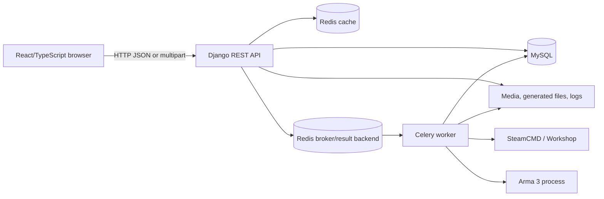
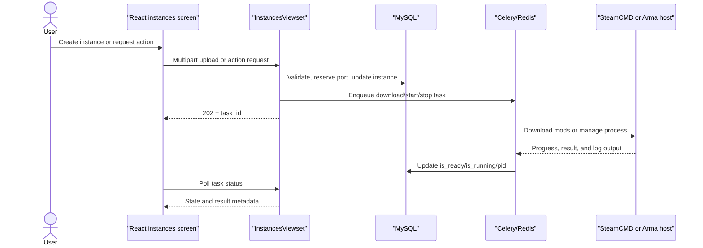

# Architecture

ArmaServerManager is a browser client backed by a Django REST API. The API owns authentication, relational state, file uploads, configuration, and authorization checks. Celery workers perform operations that may take longer than an HTTP request, while Redis provides the broker, result backend, and Django cache. SteamCMD, the Arma 3 installation, generated shell scripts, and host processes are outside the application transaction boundary.

## Component boundaries

The browser never controls a server process directly. It starts an API action, receives a Celery task ID, and polls `instances/task_status/<task_id>/` until the task reaches a terminal state. The backend updates database flags and writes logs around the external operation.

## Request and authentication flow

1. The browser posts credentials to `api/login/`.
2. Django authenticates the custom `main.Profile` user and creates a Knox token.
3. `AxiosInstance` stores the token in `localStorage` under `Token` and sends it as `Authorization: Token ...`.
4. `ProtectedRoutes` calls `account/get_user/` before rendering protected screens.
5. A `401` response removes the token and redirects to `/`.

In debug mode the client uses the configured base URL without CSRF credentials. When `VITE_DEBUG` is exactly `false`, Axios enables cookies and the CSRF header; the backend separately controls secure cookies and CORS through Django settings.

## Instance operation flow

The complete lifecycle and its failure boundaries are documented in [instance lifecycle](domain/instance-lifecycle.md). Database updates and Discord-like host operations are not one atomic transaction: a database row can be correct while a process, generated file, or log cannot be reached.

## Scheduled work

`CELERY_BEAT_SCHEDULE` schedules `check_all_servers_status_task` every 1800 seconds. A user instance receives an `instance_timeout_task` one hour after a successful start request; the task delegates to `stop_server_task`. A later start revokes the previously cached timeout task ID. The cache keys and task states are implementation details that must stay aligned with the UI polling contract.

## File and process boundaries

- Django media storage holds user presets, mission uploads, and instance log files.
- `backend/data/config.json` stores paths and Steam credentials for the host integration; it is runtime state and is ignored by Git.
- `generate_server_config` and `generate_sh_file` create host-side files used by Arma.
- `start_server` launches the generated script with `subprocess.Popen` and streams output to a log.
- `stop_server_task` discovers the recorded PID and UDP-bound processes, terminates children, and falls back to killing processes after a timeout.
- `download_mods` invokes `bash .../steamcmd.sh`, moves downloaded Workshop content from a temporary ghost folder, and cleans the folder.

These operations require an approved host and should not be exercised by repository-only checks. See [known risks](known-risks.md) and [troubleshooting](troubleshooting.md).

## Application operation logging

Application-side operation logs use Python's standard `logging` module through the small `operation_loggers` context in `backend/main/utils/operation_logging.py`. The context creates ordinary `LoggerAdapter` instances with per-operation `FileHandler`s, writes records immediately as UTF-8, and closes every handler on success, early return, or exception. It does not affect the `Instances.log_file` stream used for Arma process output and the `/logs/` API.

Create, start, and administrative preset replacement keep one timestamped operation file each. A Celery mod download uses one user-scoped timestamped directory containing `log_operations.txt` and `log_download.txt`; records at `ERROR` or above are also sent to a lazily-created `errors.txt` in that directory. The non-grouped operations use the analogous `errors_<timestamp>.txt` file. There is no automatic retention or rotation, and existing files from the removed custom logger are left untouched.

## Frontend composition

`App.tsx` mounts public login/password routes and protected dashboard, account, settings, instances, missions, and moderator routes. Context providers carry authentication, theme, and alert state. Instance screens keep task IDs in local storage so a browser refresh can continue polling visible work; the server remains the source of truth for model state.

The screen and module inventory is maintained in the [code map](code-map.md), while request details belong in the [API contract](api.md).
