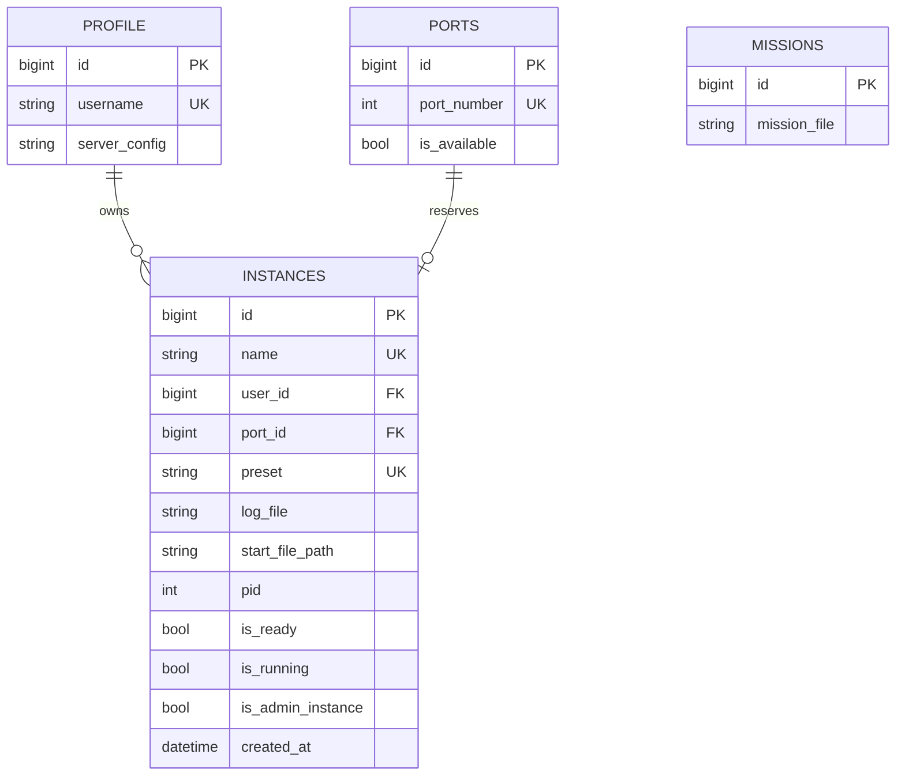

# Data model

The current schema is defined by Django models and the migration sequence in `backend/main/migrations/`. The database configured by the project is MySQL. Do not edit an applied migration; add a forward migration for schema changes.

## Entities

### `Profile`

`Profile` is the custom `AbstractUser` configured as `AUTH_USER_MODEL`. `username` is unique and may have a `server_config` path. The custom manager hashes passwords for normal and superuser creation. Deleting a profile removes its `server_config` file when the path exists.

### `Ports`

`Ports` contains a unique integer `port_number` and an `is_available` flag. Instance creation selects an available row inside a transaction and marks it unavailable. Instance deletion marks the related port available again. The `populate_ports` management command creates a requested inclusive range with `get_or_create`.

### `Instances`

An instance has a unique `name`, an owning `Profile`, a unique uploaded `preset`, optional `log_file`, optional generated `start_file_path`, a one-to-one `Ports` relation, optional process `pid`, readiness/running flags, an administrative flag, and `created_at`.

Deleting an instance removes preset, log, and generated start files if they exist, releases its port, and then deletes the row. The database `user` relation cascades when a profile is deleted.

### `Missions`

`Missions` stores an uploaded `mission_file` under the `missions/` media path. Its string representation is the stored basename. Deleting a mission removes the file if it exists. `MissionSerializer.create` deletes an existing record with the same stored filename before creating the new one.

## Relationship summary

## Consistency boundaries

- Port selection is protected by `select_for_update` during instance creation, but generated files and preset parsing occur after the transaction.
- File deletion is implemented in model overrides and does not provide a distributed transaction with the database or host process.
- `pid`, `is_running`, and `is_ready` are operational flags refreshed by Celery tasks; the `check_all_servers_status_task` reconciles them from the host process table.
- The existing migration history, not this document, determines deployed column names and defaults.
